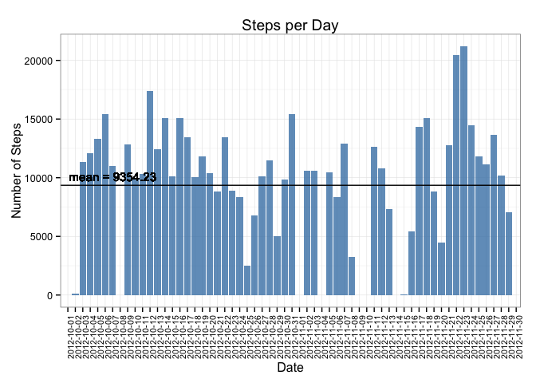
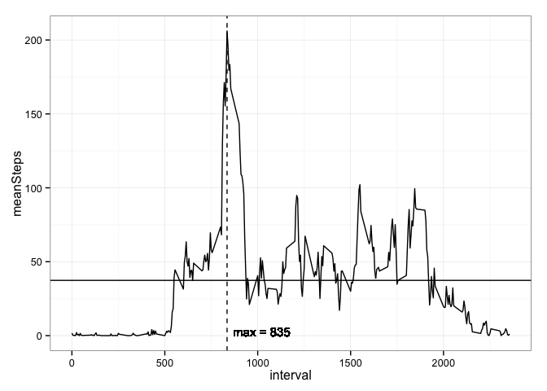
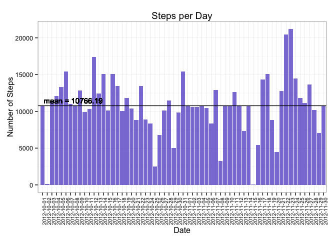
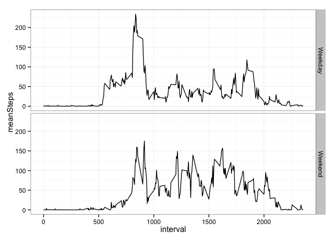

# Reproducible Research Assignment 1

Muralidhar Areti  
Jul 17, 2015

## Introduction
This R Markdown file contains the code and results of the work required for submission for the first peer assessment. 

### Loading and preprocessing the data
The first step of the assignment is to load the dataset. 

```r
suppressPackageStartupMessages(library(dplyr))
library(lubridate)
library(ggplot2)

activity_data = read.csv("activity.csv"
             , na.strings="NA"
             )
```

During my initial loads I like to print the dimensions, structure, summary and top few rows to get an idea of the data I am working with. 

```r
print(dim(activity_data))
```

```
## [1] 17568     3
```

```r
print(str(activity_data))
```

```
## 'data.frame':	17568 obs. of  3 variables:
##  $ steps   : int  NA NA NA NA NA NA NA NA NA NA ...
##  $ date    : Factor w/ 61 levels "2012-10-01","2012-10-02",..: 1 1 1 1 1 1 1 1 1 1 ...
##  $ interval: int  0 5 10 15 20 25 30 35 40 45 ...
## NULL
```

```r
print(summary(activity_data))
```

```
##      steps                date          interval     
##  Min.   :  0.00   2012-10-01:  288   Min.   :   0.0  
##  1st Qu.:  0.00   2012-10-02:  288   1st Qu.: 588.8  
##  Median :  0.00   2012-10-03:  288   Median :1177.5  
##  Mean   : 37.38   2012-10-04:  288   Mean   :1177.5  
##  3rd Qu.: 12.00   2012-10-05:  288   3rd Qu.:1766.2  
##  Max.   :806.00   2012-10-06:  288   Max.   :2355.0  
##  NA's   :2304     (Other)   :15840
```

```r
print(head(activity_data))
```

```
##   steps       date interval
## 1    NA 2012-10-01        0
## 2    NA 2012-10-01        5
## 3    NA 2012-10-01       10
## 4    NA 2012-10-01       15
## 5    NA 2012-10-01       20
## 6    NA 2012-10-01       25
```

### What is the mean total number of steps taken per day?
I like using the dplyr package because the logic (and to a lesser degree syntax) structure is very similar to SQL. The section below simply groups the data by the date (in its current form it is a string factor) and summarizes the results to provide the total number of steps measured on that day. 

```r
steps_per_day = activity_data %>%
    group_by(date) %>%
    summarize(sumSteps = sum(steps, na.rm = TRUE))

steps_per_day
```

```
## Source: local data frame [61 x 2]
## 
##          date sumSteps
## 1  2012-10-01        0
## 2  2012-10-02      126
## 3  2012-10-03    11352
## 4  2012-10-04    12116
## 5  2012-10-05    13294
## 6  2012-10-06    15420
## 7  2012-10-07    11015
## 8  2012-10-08        0
## 9  2012-10-09    12811
## 10 2012-10-10     9900
## ..        ...      ...
```

There are two ways to determine the mean and the median, the traditional way: 

```r
ms1 = mean(steps_per_day$sumSteps, na.rm = TRUE)
ms1 
```

```
## [1] 9354.23
```

```r
ms2 = median(steps_per_day$sumSteps, na.rm = TRUE)
ms2
```

```
## [1] 10395
```

And the by using dplyr:

```r
summarize(steps_per_day, mean_steps = mean(sumSteps, na.rm = TRUE))
```

```
## Source: local data frame [1 x 1]
## 
##   mean_steps
## 1    9354.23
```

```r
summarize(steps_per_day, median_steps = median(sumSteps, na.rm = TRUE))
```

```
## Source: local data frame [1 x 1]
## 
##   median_steps
## 1        10395
```

Below is the plot of the histogram showing how many steps were measured per day:

```r
steps_per_day %>%
    ggplot(aes(x=factor(date), y=sumSteps)) +
    geom_bar(fill="steelblue", stat="identity", alpha=0.8) +
    labs(x="Date") +
    labs(y="Number of Steps") + 
    labs(title="Steps per Day") +
    geom_hline(aes(yintercept = ms1)) + 
    geom_text(
        aes(0,ms1, label=paste("mean =", round(ms1,2)))
        , vjust=-0.5
        , hjust=-0.1
        , size=4
        ) +
    theme_bw() +
    theme(axis.text.x = element_text(angle=90, size=8))
```

 


### What is the average daily activity pattern?
First we must perform some data management tasks to ensure we have the right details required for plotting. 

```r
steps_per_interval = activity_data %>%
    group_by(interval) %>%
    summarize(
        sumSteps = sum(steps, na.rm = TRUE)
        , meanSteps = mean(steps, na.rm = TRUE)
        )

steps_per_interval
```

```
## Source: local data frame [288 x 3]
## 
##    interval sumSteps meanSteps
## 1         0       91 1.7169811
## 2         5       18 0.3396226
## 3        10        7 0.1320755
## 4        15        8 0.1509434
## 5        20        4 0.0754717
## 6        25      111 2.0943396
## 7        30       28 0.5283019
## 8        35       46 0.8679245
## 9        40        0 0.0000000
## 10       45       78 1.4716981
## ..      ...      ...       ...
```

```r
ms3 = mean(steps_per_interval$meanSteps, na.rm = TRUE)
ms4 = steps_per_interval %>%
    filter(meanSteps == max(meanSteps)) %>%
    select(interval)

steps_per_interval %>%
    ggplot(aes(x=interval, y=meanSteps)) + 
    geom_line() +
    geom_hline(aes(yintercept = ms3)) + 
    geom_vline(xintercept = as.numeric(ms4), linetype="dashed") +
    geom_text(
        aes(as.numeric(ms4),0, label=paste("max =", round(as.numeric(ms4),0)))
        , vjust=0
        , hjust=-0.1
        , size=4
        ) +
    theme_bw()
```

 

The chart shows you the mean (solid horizontal line) and the interval that had the most steps (vertical dashed line). The maximum number of steps was measured at interval 835. 

### Imputing missing values
Earlier we did a few tests on the data to see what we are working with. The summary command will provide a simple means for determining the number of NA's in our data set. 

```r
print(summary(activity_data))
```

```
##      steps                date          interval     
##  Min.   :  0.00   2012-10-01:  288   Min.   :   0.0  
##  1st Qu.:  0.00   2012-10-02:  288   1st Qu.: 588.8  
##  Median :  0.00   2012-10-03:  288   Median :1177.5  
##  Mean   : 37.38   2012-10-04:  288   Mean   :1177.5  
##  3rd Qu.: 12.00   2012-10-05:  288   3rd Qu.:1766.2  
##  Max.   :806.00   2012-10-06:  288   Max.   :2355.0  
##  NA's   :2304     (Other)   :15840
```

Something additional to look at, how many NA records do we have per day? The code below applies the same methodology from determining the number of steps per day, determines how many NA values are present for each data and filters the data set to show only the days that have NA values and the number of NA values for that day. 

```r
na_per_day = activity_data %>%
    group_by(date) %>%
    summarize(
        sumSteps = sum(steps, na.rm=TRUE)
        , numRecords = n()
        , numNa = sum(is.na(steps))
        ) %>%
    filter(numNa > 0)

na_per_day
```

```
## Source: local data frame [8 x 4]
## 
##         date sumSteps numRecords numNa
## 1 2012-10-01        0        288   288
## 2 2012-10-08        0        288   288
## 3 2012-11-01        0        288   288
## 4 2012-11-04        0        288   288
## 5 2012-11-09        0        288   288
## 6 2012-11-10        0        288   288
## 7 2012-11-14        0        288   288
## 8 2012-11-30        0        288   288
```


The results above shows 8 reccords containing 1 or more NA values. The total number of NA values in the dataset is 2304 (same number as shown in the summary). 

A simple strategy that can be used to fill in these missing values with the mean value. 

Note: I would like to get fancy and use a a normal distribution on the existing data to determine the mean and standard deviation of the steps, use a random number generator with these results to populate an approximation of the steps on that day, but that strategy is rather sophisticated and would take quite some time & effort to produce. It would be a better model/simulation than just using the median or mean though. 


```r
average_steps = mean(activity_data$steps, na.rm=TRUE)
average_steps
```

```
## [1] 37.3826
```

```r
imputed_data = activity_data %>%
    mutate(imputed_steps = ifelse(is.na(steps), average_steps, steps))

imputed_steps_per_day = imputed_data %>%
    group_by(date) %>%
    summarize(
        sumSteps = sum(steps, na.rm = TRUE)
        , imputed_sumSteps = sum(imputed_steps, na.rm=TRUE)
        )
```

Recreating the previous histogram with the imputed data we get:

```r
ms5 = mean(imputed_steps_per_day$imputed_sumSteps, na.rm = TRUE) 
ms5
```

```
## [1] 10766.19
```

```r
ms6 = median(imputed_steps_per_day$imputed_sumSteps, na.rm = TRUE)
ms6
```

```
## [1] 10766.19
```

```r
imputed_steps_per_day %>%
    ggplot(aes(x=factor(date), y=imputed_sumSteps)) +
    geom_bar(fill="slateblue", stat="identity", alpha=0.8) +
    labs(x="Date") +
    labs(y="Number of Steps") + 
    labs(title="Steps per Day") +
    geom_hline(aes(yintercept = ms5)) + 
    geom_text(
        aes(0,ms5, label=paste("mean =", round(ms5,2)))
        , vjust=-0.5
        , hjust=-0.1
        , size=4
        ) +
    theme_bw() +
    theme(axis.text.x = element_text(angle=90, size=8))
```

 

The charts look similar, but still shows there are some questions to be made with the data regarding days where there is a huge variation in the steps measured. This could be a result of having to charge the device, hence it was plugged in and stationary, or the wearer just didn't have it on. Filling in the NA results with just the mean doesn't account for these other reasons. 

### Are there differences in activity patterns between weekdays and weekends?
First lets check to see if we can determine which days are weekdays:

```r
# weekday_dataset = activity_data %>%
activity_data %>%
   mutate(
        date = as.Date(date)
        , weekdayName = weekdays(date)
        , weekendFlag = ifelse(
            weekdayName == "Sunday" | weekdayName == "Saturday"
            , "Weekend"
            , "Weekday"
            )
        ) %>%
    group_by(weekendFlag, interval) %>%
    summarize(meanSteps = mean(steps, na.rm=TRUE)) %>%
    ggplot(aes(x=interval, y=meanSteps)) + 
    geom_line() +
    facet_grid(weekendFlag ~ .) +
    theme_bw()
```

 

Now that the dataset has been set we can create our desired plot. 

```r
# weekday_dataset %>%
#     ggplot(aes(x=interval, y=meanSteps)) + 
#     geom_line() +
#     facet_grid(weekendFlag ~ .) +
#     theme_bw()
```

The plot would likely be more informative if the actual time was used instead of an interval. At a glance I'm guessing the subject gets up in the morning, has a huge activity spike (getting ready for work perhaps?) and then sits at a desk for most of the day and then winds down (carpools home?). The weekend has higher peaks than during the week,  most likely moves around more or has activities/chores to do over the weekends. 

End of file. 
