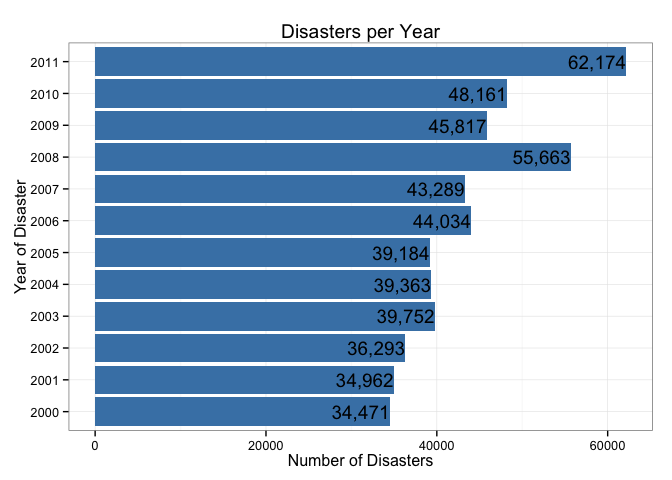

# US Disasters 2000-2011
Muralidhar Areti  
Jul 24, 2015

## Synopsis
In this report we aim to assess the impact various disasters by utilizing the NOAA storm database that tracks characteristics of major storms and weather events in the United States to assess and present their respective effects on fatality, injury and property damage estimates. 


## Data Processing
The data from the NOAA storm database begins in 1950 and ends in 2011. For this assessment we will only evaluate data for the period 2000 to 2011. 

* Initializing the environment in R
    - Load required libraries
    - Download the data set
* Data Processing
    - Perform initial data cleansing and manipulations
    - Filter for the required criteria (variables and date range)

### Initializing the Data
The first step in the data processing is to initialilze the environment by loading the required libraries for analysis and presentation. 


```r
library(tidyr)
suppressPackageStartupMessages(library(dplyr))
library(lubridate)
library(ggplot2)
library(scales)
```

The next step is to gather the data. The dataset is made available originally from the National Weather Service, the url below is a direct link to the file. Because this file is very large, it is important to cache the code chunk to allow for quicker processing and analysis.  


```r
url = "https://d396qusza40orc.cloudfront.net/repdata%2Fdata%2FStormData.csv.bz2"
download.file(url, destfile="./data.csv.bz2", method="curl")
data = read.csv("data.csv.bz2")
```

After loading the data we perform some simple commands to better understand what we are workign with. First we look at the dimensions to understand the number of variables and observations we are working with, then the variable names that are available and finally the structure, summary and top few rows of the data to understand the data types and the data we are working with.  


```r
print(dim(data))
```

```
## [1] 902297     37
```

```r
print(names(data))
```

```
##  [1] "STATE__"    "BGN_DATE"   "BGN_TIME"   "TIME_ZONE"  "COUNTY"    
##  [6] "COUNTYNAME" "STATE"      "EVTYPE"     "BGN_RANGE"  "BGN_AZI"   
## [11] "BGN_LOCATI" "END_DATE"   "END_TIME"   "COUNTY_END" "COUNTYENDN"
## [16] "END_RANGE"  "END_AZI"    "END_LOCATI" "LENGTH"     "WIDTH"     
## [21] "F"          "MAG"        "FATALITIES" "INJURIES"   "PROPDMG"   
## [26] "PROPDMGEXP" "CROPDMG"    "CROPDMGEXP" "WFO"        "STATEOFFIC"
## [31] "ZONENAMES"  "LATITUDE"   "LONGITUDE"  "LATITUDE_E" "LONGITUDE_"
## [36] "REMARKS"    "REFNUM"
```

```r
# print(str(data))
# print(summary(data))
# print(head(data))
```

Now that we have a good idea of what we are working with, we need to gather a subset of the data to meet our desired criteria.  


```r
working_data = data %>%
    select(
        BGN_DATE
        , STATE
        , COUNTYNAME
        , EVTYPE
        , FATALITIES
        , INJURIES
        , PROPDMG
        ) %>%
    mutate(
        BGN_DATE = mdy_hms(BGN_DATE)
        , bgn_year = year(BGN_DATE)
        , bgn_month = month(BGN_DATE)
        ) %>%
    filter(year(BGN_DATE) >= 2000)
```


## Results
The chart below shows the number of disasters that were recorded in the database during the period 2000-2011. 


```r
working_data %>% 
    group_by(bgn_year) %>%
    summarize(DisastersPerYear = n()) %>%
    ggplot(aes(x=factor(bgn_year), y=DisastersPerYear)) +
    geom_bar(fill="steelblue", stat="identity") + coord_flip() +
    geom_text(aes(label=format(DisastersPerYear, format="d", big.mark=',')
                  , hjust=1)) +
    labs(x="Year of Disaster") +
    labs(y="Number of Disasters") + 
    labs(title="Disasters per Year") +
    theme_bw() 
```

 

This shows a steady occurance of disasters indicating constant vigilance must be shown to be adequately prepared for these events.  

The chart below the top 10 disasters that have had the highest impact on population health based on injuries and fatalities through 2000-2011:


```r
working_data %>%
    group_by(EVTYPE) %>%
    summarize(
        SumFatalities = sum(FATALITIES)
        , SumInjuries = sum(INJURIES)
        , SumFatInj = sum(FATALITIES) + sum(INJURIES)
        ) %>%
    top_n(10) %>% 
    arrange(desc(SumFatInj)) %>%
    gather(MeasureType, MeasureValue, SumFatalities:SumInjuries) %>%
    ggplot(aes(x=factor(EVTYPE), y=MeasureValue, fill=MeasureType)) + 
    geom_bar(stat="identity") + coord_flip() + 
    scale_fill_brewer() +
    labs(x="Disaster Type") + 
    labs(y="Measure Value") + 
    labs(title="Top 10 Disasters by Injuries and Fatalities") +
    theme_bw()
```

```
## Selecting by SumFatInj
```

 

During 2000-2011 tornadoes have by far done the most damage to the population. It also shows many ocurrances of injuries that could be mitigated by implementing better safety precautions, e.g. lighting rods and temperature indicators, and better disaster awareness programs. 

The chart below shows the yearly effects of disasters in the United States. The disasters chosen were based on the total property damage throughout the period 2000-2011. 


```r
top_pd = working_data %>%
    group_by(EVTYPE) %>%
    summarize(SumPropertyDamage = sum(PROPDMG)) %>%
    top_n(5) %>% 
    arrange(desc(SumPropertyDamage)) %>%
    select(EVTYPE)
```

```
## Selecting by SumPropertyDamage
```

```r
sub_data = inner_join(x=working_data, y=top_pd)
```

```
## Joining by: "EVTYPE"
```

```r
sub_data %>% 
    group_by(bgn_year, EVTYPE) %>%
    summarize(SumPropertyDamage = sum(PROPDMG)) %>%
    ggplot(aes(x=factor(bgn_year), y=SumPropertyDamage, fill=EVTYPE)) + 
    geom_bar(stat="identity") + 
    scale_y_continuous(labels=dollar) +
    scale_fill_brewer() +
    labs(x="Disaster Year") + 
    labs(y="Measure Value") + 
    labs(title="Property Damage of the 5 Most Damaging Disasters") +
    theme_bw() +
    theme(axis.text.x = element_text(angle=90, size=10))
```

 

This shows a steady increase in property damage over the years

## Conclusion
The results provided are merely a preliminary study of the impact of these storms. The results provide evidence that more research and studies are required to better understand the nature of these disasters to allow us to provide solutions on how to mitigate these damages. For example, by drilling down the property damage results to the state or county level we can understand what are types of disasters occur in these areas and narrow down to specific solutions to these problems. 

End of File
